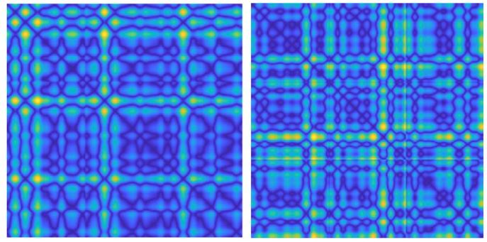

# Modern EEG-Based Lie Detection via P300 Waveform Analysis & Deep Learning

[](https://www.python.org/)
[](https://www.mathworks.com/)
[](https://tensorflow.org/)
[](https://opensource.org/licenses/MIT)

An advanced biomedical signal processing and deep learning framework designed for modern lie detection (deception detection) using Event-Related Potentials (**P300 waves**) from Electroencephalogram (**EEG**) signals.

This project bridges classical signal processing (Bandpass filtering, CAR/CSP filtering, Wavelet Transforms, Welch PSD) with state-of-the-art Deep Learning models (**DeepConvNet**, **EEGNet**, and **Xception** on **Recurrence Plots**).

---

## 📸 System Overview & GUI

A custom Graphical User Interface (GUI) was developed as an MVP to allow seamless signal loading, feature extraction (FFT, CWT, Welch), and real-time deception classification.

<p align="center">
  
</p>

---

## 📌 Key Features & Highlights

* **P300 ERP Paradigm Setup**: Utilizes Target, Irrelevant, and Probe stimuli paradigms to elicit neural responses indicative of hidden information.
* **Dual-Domain Signal Analysis**:
  * **Time & Frequency Analysis**: Bandpass filtering, CAR (Common Average Reference), and CSP (Common Spatial Pattern) spatial filtering.
  * **Non-linear Dynamics**: Converts 1D temporal EEG signals into 2D phase-space images using **Recurrence Plots (RP)**.
* **Deep Learning Frameworks**:
  * **End-to-End EEG Architectures**: Customized **DeepConvNet** and **EEGNet** trained directly on multi-channel time-series EEG data.
  * **Computer Vision Architectures**: Fine-tuned **Xception** network trained on 2D Recurrence Plot images.
* **Experimental Data Collection**: Includes experimental evaluation on both benchmark datasets (48 subjects) and custom-recorded 64-channel EEG data at IPM (16 subjects).

---

## 📊 Methodology & Workflow

<p align="center">
  
  <br>
  <em>Figure: 2D Recurrence Plots generated from EEG Probe signals.</em>
</p>

1. **Preprocessing**: Raw EEG signals are bandpass-filtered ($0.3–30\text{ Hz}$), artifact-corrected, segmented into epoch ranges ($0.0–1.0\text{s}$ or $0.3–0.6\text{s}$), and spatially re-referenced via CAR/CSP.
2. **Feature Representation**:
   * *Option A*: Raw multi-channel epoch arrays ($N_{\text{channels}} \times N_{\text{samples}}$).
   * *Option B*: Phase-space trajectory distance matrices converted into 2D Recurrence Plots.
3. **Classification**: Evaluation across classical ML (Quadratic SVM, Ensemble Bagged Trees) and Deep Convolutional Networks.

---

## 📈 Experimental Results

Our proposed pipeline outperforms conventional methods reported in literature:

| Model Architecture | Input Representation | Signal Channels | Target Window | Accuracy (%) | ROC AUC |
| :--- | :--- | :---: | :---: | :---: | :---: |
| **Quadratic SVM** | Time Domain Features | 11 Channels | $0.0 - 0.3\text{s}$ | 68.3% | - |
| **Xception CNN** | 2D Recurrence Plots | 3 Channels | $0.3 - 0.6\text{s}$ | 64.3% | 0.642 |
| **EEGNet + CAR + CSP** | Time Series Epochs | 19 Channels | $0.0 - 1.1\text{s}$ | 88.1% | 0.938 |
| **DeepConvNet + CSP** *(Best)* | Time Series Epochs | 19 Channels | $0.0 - 1.0\text{s}$ | **81.2%** | **0.947** |

---

## 📁 Repository Structure

```text
├── data_preprocessing/
│   ├── classification_alldata_allchannel_rangefour.m  # MATLAB script for loading, filtering, & segmenting EEG data
│   └── alldata_allchannel_RP_rangefour_concat.m       # MATLAB script generating 2D Recurrence Plots
├── models/
│   ├── deepconvnet_allchannel_rangefour.py            # DeepConvNet model with 5-Fold Stratified CV
│   ├── eegnet_allchannel_rangefour.py                 # EEGNet architecture implementation
│   └── xception_rp_alldata_allchannel_rangefour_concat.py # Xception CNN fine-tuning on RP images
├── assets/                                            # Screenshots, diagrams, and ROC plots
├── requirements.txt                                   # Python dependencies
└── README.md                                          # Project documentation
