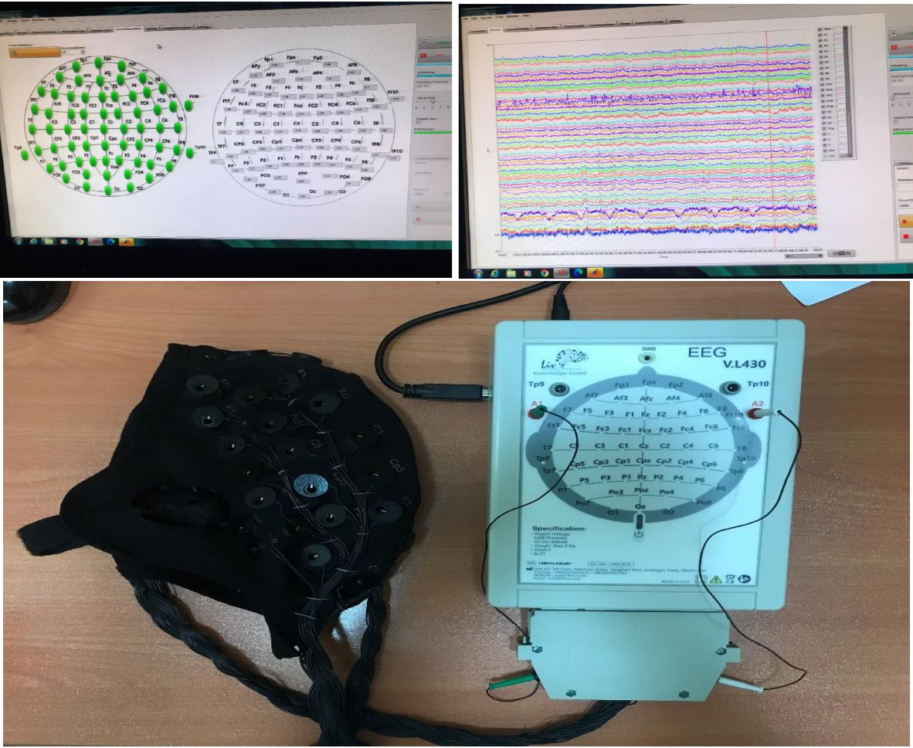
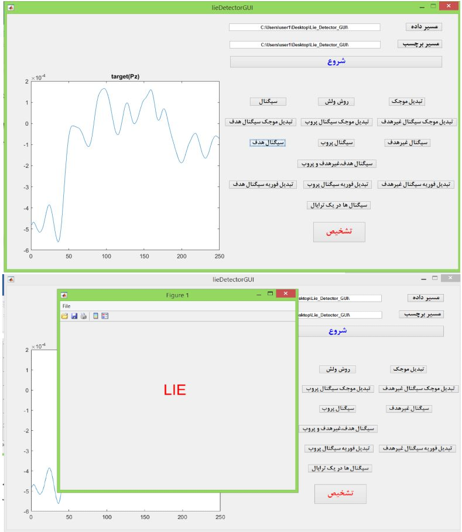

# Modern EEG-Based Lie Detection via P300 Waveform Analysis & Deep Learning

[](https://www.python.org/)
[](https://www.mathworks.com/)
[](https://tensorflow.org/)
[](https://opensource.org/licenses/MIT)

An advanced biomedical signal processing and deep learning framework designed for modern lie detection (deception detection) using Event-Related Potentials (**P300 waves**) from Electroencephalogram (**EEG**) signals. 

This project bridges classical signal processing (Bandpass filtering, CAR/CSP filtering, Wavelet Transforms, Welch PSD) with state-of-the-art Deep Learning models (**DeepConvNet**, **EEGNet**, and **Xception** on **Recurrence Plots**).

---

## 📌 Project Background & Motivation

Deception detection has always been a matter of critical importance for judicial systems, security organizations, and corporate hiring processes. Classical polygraphs relied on peripheral physiological signals such as respiratory rate, heart rate, and skin conductance—but these are prone to countermeasures and can be fooled. 

This project takes a different route: it taps directly into the brain's automatic response to familiar, concealed information using the **P300 component** of EEG.

When a subject recognizes a probe stimulus (e.g., a stolen document, a weapon, or a crime scene photo), a P300 wave is automatically elicited—an involuntary neural response that cannot be consciously suppressed. If they have no prior knowledge of the item, no P300 appears. Target and irrelevant stimuli serve as controls to validate subject cooperation and ensure adequate signal quality. This paradigm forms the foundation of a modern, EEG-based lie detection system.

The project was carried out in two main phases:
1. **Theoretical Phase**: Analyzing an existing 48-subject benchmark dataset.
2. **Practical-Theoretical Phase**: Designing a new deception task, recording 64-channel EEG data from 16 subjects at IPM, and re-evaluating the developed algorithms on fresh data.

---

## 🔬 Phase 1: Theoretical Analysis (Benchmark Dataset)

### Dataset Exploration & Key Findings
* **Initial Exploration**: Began with a 48-subject benchmark dataset recorded for a deception task. Signals with acceptable electrode impedance were retained, focusing on midline channels (**Fz, Cz, Pz**). Signal quality was evaluated using **CWT** and **FFT** over a 1.1-second stimulation window.
* **The P300 Window**: Comparing target, probe, and irrelevant stimuli revealed that the **0.3–0.6 second window** (the classic P300 latency range) provided the best discriminability.
* **Expanding Analysis**: Applied **Welch PSD** and **CAR filtering**. Testing both 0.0–0.6 s and 0.3–0.6 s windows showed that ~16 subjects exhibited poor data quality/unsuitability for truth verification and were excluded.
* **Optimal Channel Setup**: Comparing 3-channel vs. 4-channel configurations indicated that the best separation between truthful and deceptive groups was achieved using **4-channel data, CAR filtering, and the 0.0–0.6 s window**.

### Machine Learning & Recurrence Plots
* **Classical ML**: Explored various channel combinations (3, 7, 8, 11 channels) and time windows. The **Quadratic SVM** achieved **63.1% accuracy** using 11 channels in the 0.0–0.3 s window without CAR filtering.
* **Recurrence Plots (RP) & CNNs**: To enhance classification accuracy, 1D EEG signals were transformed into 2D Recurrence Plots and fed into deep networks (Xception, EfficientNetB0/B1/B2).
* **Direct EEG Classification**: Evaluated end-to-end architectures (**EEGNet**, **DeepConvNet**, CNN1, CNN3, BN3) alongside CSP spatial filtering.
* **Theoretical Standout**: **EEGNet** trained on **all 19 channels**, using the full **1.1 s window** with **CAR + CSP filters**, yielded the highest performance in this phase.

---

## 🧪 Phase 2: Practical-Theoretical Research (New Task & IPM Data)

### Redesigning the Deception Task
To overcome task design limitations identified in the benchmark dataset, a novel deception protocol was developed in **Psychtoolbox**. Each stimulus image was displayed for ~2 seconds across **3 trials × 10 repetitions**.

<p align="center">
  
  <br>
  <em>Figure: 64-channel EEG experimental recording setup at IPM.</em>
</p>

### EEG Data Collection & Validation at IPM
* **Participants**: Recorded **64-channel EEG** from 16 subjects (8 "guilty", 8 "innocent") at the IPM School of Cognitive Sciences.
* **Signal Verification**: Extracted FFT, CWT, energy, power, and cross-correlations between Probe and Target/Irrelevant signals.
* **Neural Validation**:
  * **Guilty subjects**: Distinct **P300 waveforms** elicited in response to both **Probe** and **Target** stimuli.
  * **Innocent subjects**: P300 waveforms appeared **only** in response to **Target** stimuli.

### Machine Learning & Deep Learning Performance
* **Ensemble Bagged Trees**: Achieved **67.9% accuracy** on 19 channels over a 1-second stimulation window (ROC AUC = 0.74).
* **DeepConvNet + CSP**: Delivered superior results on the new experimental dataset:
  * **Accuracy**: **81.2%**
  * **ROC AUC**: **0.947** (for classifying truthful vs. deceptive Probe signals using 19 channels, 1-second window, and CSP filter).

---

## 📸 System Overview & GUI MVP

To transition the algorithms from research code to a practical MVP, a standalone **MATLAB GUI** (compiled into a `.exe` application) was developed.

<p align="center">
  
</p>

### GUI Features:
1. **Data Loading**: Easily specify the EEG data directory and ground-truth label files.
2. **Automated Feature Extraction**: Computes and visualizes raw signals, Welch PSD, CWT, and stimulus components (Target, Probe, Irrelevant) with a single click. Figures are automatically saved.
3. **Deception Detection**: Clicking **"Detect"** executes the trained classification pipeline, instantly displaying whether a test signal represents a **TRUTH** or a **LIE**.

---

## 📊 Experimental Results & Literature Benchmark

Our proposed deep learning framework with CSP spatial filtering outperforms several existing EEG lie detection approaches reported in literature:

| Method / Study | Approach | Signal Representation | Accuracy (%) | ROC AUC |
| :--- | :--- | :--- | :---: | :---: |
| **Proposed (Phase 1)** | EEGNet + CAR + CSP | 19 Channels (1.1s Window) | **88.1%** | 0.938 |
| **Proposed (Phase 2)** *(Best)* | DeepConvNet + CSP | 19 Channels (1.0s Window) | **81.2%** | **0.947** |
| Baghel et al. (2020) [1] | Convolutional Neural Networks | EEG Signals | 84.44% | - |
| Syed Anwar et al. (2019) [3] | DWT + PCA + SVM | Wearable EEG Headset | 83.0% | - |
| Lai et al. (2018) [2] | Fuzzy Reasoning Approach | ERP Waveforms | 70.3% | - |
| **Proposed (Classical ML)** | Ensemble Bagged Trees | 19 Channels (New Data) | 67.9% | 0.740 |
| **Proposed (Classical ML)** | Quadratic SVM | 11 Channels (Benchmark Data) | 63.1% | - |

---

## 📌 Key Takeaways

1. **Task Design Matters**: Benchmark datasets often suffer from suboptimal task timing, causing high subject dropouts. The redesigned 2-second stimulus task significantly improved signal purity.
2. **Deep Learning Superiority**: Architectures such as **EEGNet** and **DeepConvNet** combined with **CSP spatial filtering** consistently outperformed traditional manual feature extraction and shallow classifiers.
3. **P300 Robustness**: Involuntary P300 responses serve as highly reliable physiological markers for deception detection when processed with modern neural networks.

---

## 📁 Repository Structure

```text
├── data_preprocessing/
│   ├── classification_alldata_allchannel_rangefour.m  # MATLAB script for filtering, CAR, CSP & epoching
│   └── alldata_allchannel_RP_rangefour_concat.m       # MATLAB script generating 2D Recurrence Plots
├── models/
│   ├── deepconvnet_allchannel_rangefour_car.py            # DeepConvNet model with 5-Fold Stratified CV
│   ├── eegnet_allchannel_rangefour.py                 # EEGNet architecture implementation
│   └── xception_rp_alldata_allchannel_rangefour_concat.py # Xception CNN fine-tuning on RP images
├── assets/                                            # Screenshots, diagrams, and ROC plots
├── requirements.txt                                   # Python dependencies
└── README.md                                          # Project documentation
